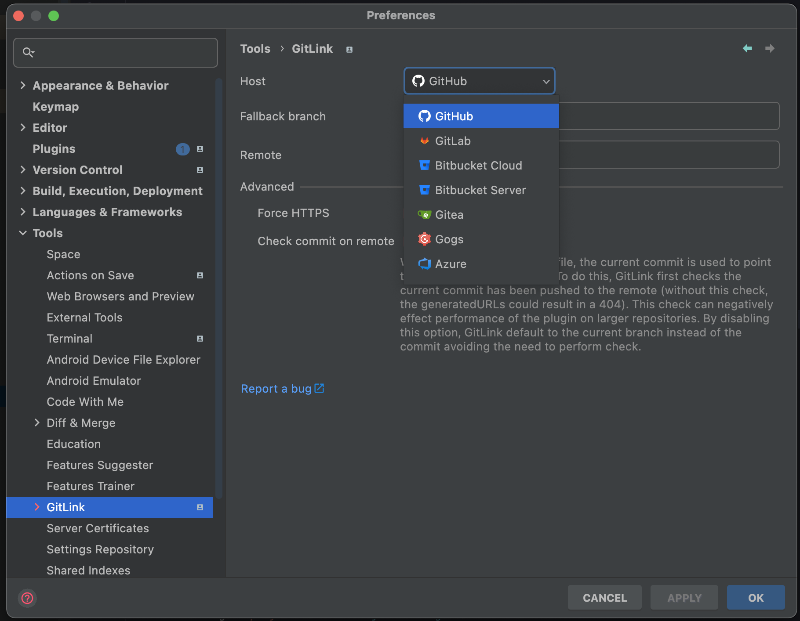

# Beautiful GitLink – JetBrains 插件


[](README.md)

<!-- 插件描述 -->

Beautiful GitLink 为 IntelliJ IDEA、WebStorm 以及所有 JetBrains 系列 IDE 带来一键式远程跳转体验。无需离开编辑器，即可打开或复制当前文件、目录或提交的远程链接，并且能够根据团队使用的 Git 平台自定义行为。

<!-- 插件描述结束 -->

> 想在 VS Code 中使用？可以试试 [Beautiful GitLink for VS Code](https://marketplace.visualstudio.com/items?itemName=AlanHe.cn-alanhe-gitlink&ssr=false#overview)。

## 特性

- 在编辑器、侧边栏、项目视图或 Git 日志中，一键打开当前文件、目录或提交的浏览器链接。
- 支持复制远程链接为纯文本或 Markdown，包括可带有当前选区内容的富 Markdown 片段。
- 提供代码片段图片生成功能，内置实时预览、画笔标注、双击清除绘制、可选水印以及 ray.so 导出。
- 自动检测远程托管平台；当最新提交尚未推送时，可回退到可自定义的模板生成链接。
- 可按动作自定义菜单展示层级，让常用功能直接出现在顶层右键菜单。
- 支持添加自定义 Git 平台，分别配置分支、提交、文件链接模板，并维护各平台的域名映射。
- 兼容 HTTPS 与 SSH 远程地址，支持多行选区以生成精确的行号引用。

## 内置支持的平台

- [GitHub](https://github.com)
- [GitLab](https://gitlab.com)
- [Bitbucket Cloud](https://bitbucket.org)
- Bitbucket Server / Data Center（域名模式匹配）
- [Gitea](https://gitea.io)
- [Gogs](https://gogs.io)
- [Gitee](https://gitee.com)
- [SourceHut](https://git.sr.ht)
- [Azure DevOps](https://dev.azure.com)
- Chromium Gerrit（googlesource.com）
- Gerrit（域名模式匹配）
- [腾讯 Coding](https://coding.net)
- [腾讯 TGit](https://git.code.tencent.com)

可在 **Settings → Tools → GitLink → Custom Platforms** 中添加自定义平台，提供分支 / 提交 / 文件模板以及可选域名，GitLink 会自动切换。额外的域名映射可在 **Settings → Tools → GitLink → Domain Registry** 中维护。

<div>
  <a href="https://plugins.jetbrains.com/plugin/8183-gitlink">
    
  </a>
</div>
<div>
  <a href="https://plugins.jetbrains.com/plugin/8183-gitlink">
    
  </a>
</div>

## 使用方式

安装插件后，如果没有自动检测到远程平台，可手动配置：

      Preferences → Tools → GitLink

确保已在版本控制设置中注册项目根目录：

      Preferences → Version Control（查看未注册的路径）

打开当前文件的浏览器链接：

      View → Open in (所选平台)
      Select in... → Browser (GitLink)

还可以在编辑器侧边栏、右键菜单、Git 日志窗口等位置使用额外的快捷方式。

可生成的链接类型包括：

* 指向指定提交的文件
* 指向分支上最新版本的文件
* 提交详情页

默认情况下，生成文件链接时会使用最新提交的哈希值，以固定内容版本。如果最新提交尚未推送，则会回退到当前分支，避免生成 404 链接，但需要注意远程内容可能随时间变化。

## 安装

- 通过 IDE 内置插件市场：

  <kbd>Settings/Preferences</kbd> > <kbd>Plugins</kbd> > <kbd>Marketplace</kbd> > 搜索 “GitLink” > <kbd>Install Plugin</kbd>

- 手动安装：

  下载 [最新发行版](https://github.com/ben-gibson/GitLink/releases/latest)，然后通过 <kbd>Settings/Preferences</kbd> > <kbd>Plugins</kbd> > <kbd>⚙️</kbd> > <kbd>Install plugin from disk...</kbd> 安装。

## 构建

```shell
./gradlew buildPlugin
```

## 支持项目

* 点亮 Star 支持项目
* [在插件市场评分](https://plugins.jetbrains.com/plugin/8183-gitlink)
* [分享插件给团队成员](https://plugins.jetbrains.com/plugin/8183-gitlink)

## 更新日志

项目最近变更请查看 [CHANGELOG](CHANGELOG.md)。

