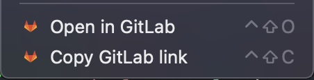
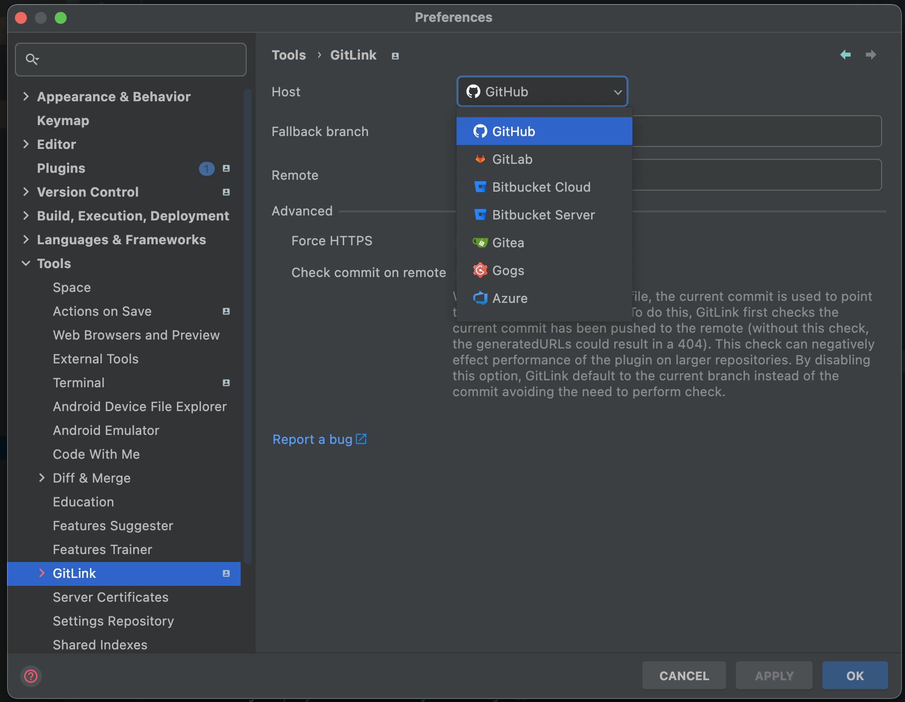

# Beautiful GitLink – JetBrains Plugin


[](README-zh.md)

<!-- Plugin description -->

Beautiful GitLink brings one-click remote navigation to IntelliJ IDEA, WebStorm and every JetBrains IDE. Open or copy the
remote URL for the current file, directory or commit without ever leaving the editor, and tailor the experience to the
Git platform your team uses.

<!-- Plugin description end -->

> Looking for the VS Code extension? Try [Beautiful GitLink for VS Code](https://marketplace.visualstudio.com/items?itemName=AlanHe.cn-alanhe-gitlink&ssr=false#overview).

## Features

- Open the current file, directory, or commit in your browser from the editor, gutter, project view, or Git log.
- Copy remote URLs as plain links or Markdown, including rich snippets that capture the current selection.
- Generate shareable code snippet images with a live preview, annotation pen, double-click-to-clear drawings, and
  optional watermarks or ray.so export.
- Automatically detect the remote host and fall back to customizable templates when the commit is not yet pushed.
- Configure menu placement per action so frequently used commands stay near the top-level context menu.
- Add custom Git platforms with separate templates for branch, commit, and file URLs; manage domain overrides per
  platform.
- Works with both HTTPS and SSH remotes and supports multi-line selections for precise line references.

## Built-in Supported Platforms

- [GitHub](https://github.com)
- [GitLab](https://gitlab.com)
- [Bitbucket Cloud](https://bitbucket.org)
- Bitbucket Server / Data Center (pattern match)
- [Gitea](https://gitea.io)
- [Gogs](https://gogs.io)
- [Gitee](https://gitee.com)
- [SourceHut](https://git.sr.ht)
- [Azure DevOps](https://dev.azure.com)
- Chromium Gerrit (googlesource.com)
- Gerrit (pattern match)
- [腾讯 Coding](https://coding.net)
- [腾讯 TGit](https://git.code.tencent.com)

Custom hosts can be added from **Settings → Tools → GitLink → Custom Platforms**. Provide branch/commit/file templates
and optional domains so GitLink can switch automatically. Additional domain mappings can be maintained under **Settings →
Tools → GitLink → Domain Registry**.

<div>
  <a href="https://plugins.jetbrains.com/plugin/8183-gitlink">
    
  </a>
</div>
<div>
  <a href="https://plugins.jetbrains.com/plugin/8183-gitlink">
    
  </a>
</div>

## Usage

Install the plugin and configure your remote host if it hasn't been auto-detected already:

      Preferences → Tools → GitLink

Make sure you have registered your projects root under the version control preferences:

      Preferences → Version Control (see unregistered roots)

To open the current file in the default browser:

      View → Open in (your selected host) or
      Select in... → Browser (GitLink)

Additional shortcuts are available including from the editor gutter and Git log window.

A URL can be generated in one of the following ways:

* File at a commit
* File at a branch
* Commit

By default, when generating a URL to a file, the latest commit hash is used, creating a reference to a fixed version of 
the file's content. If the latest commit has not been pushed to the remote, the current branch is used instead. 
While this avoids generating a URL to a 404, it does mean the linked contents can change over time.

## Installation

- Using IDE built-in plugin system:

  <kbd>Settings/Preferences</kbd> > <kbd>Plugins</kbd> > <kbd>Marketplace</kbd> > <kbd>Search for "GitLink"</kbd> >
  <kbd>Install Plugin</kbd>

- Manually:

  Download the [latest release](https://github.com/ben-gibson/GitLink/releases/latest) and install it manually using
  <kbd>Settings/Preferences</kbd> > <kbd>Plugins</kbd> > <kbd>⚙️</kbd> > <kbd>Install plugin from disk...</kbd>


## Build 

```shell
./gradlew buildPlugin
```

## Support

* Star the repository
* [Rate the plugin](https://plugins.jetbrains.com/plugin/8183-gitlink)
* [Share the plugin](https://plugins.jetbrains.com/plugin/8183-gitlink)
  
## Change log

Please see [CHANGELOG](CHANGELOG.md) for more information what has changed recently.
